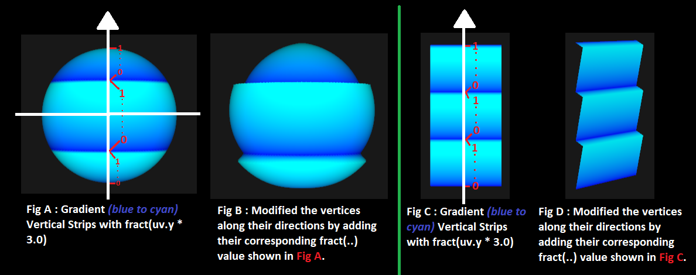
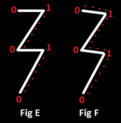

The final output :
<video controls src="output_video.mp4" title="Title"></video>

The self-explanatory theory (At first follow Fig C -> D, then A -> B):

Always create the Fig A (or C),
then smooth the edges using e.g., the custom smoothstep() I've coded,
then Fig B t0 modify he vertices along their direction (if you want),
and then finally animate it (if you want).

Note : After creating Fig A, to smooth the top side edges of each (horizontal) strip (Since after cyan, there is pure blue color), I
created that smoothstep_for_gradient() function in fragmentShader. Then for Fig B, I saw some jaggy edges and instead of "fract(pattern_coordinate.y * 3.0)", I wrote "smoothstep_for_gradient(0.95, 1.0, fract(pattern_coordinate.y * 3.0))" and most of the jagginess disappeared.

What I did is, instead of going 0 ... 1, and then 0 ... 1 and so on which creates straight diagonal lines (Fig D) that potentially introduce jagginess because right after 1(pure cyan color) there is 0(pure blue color), now it goes 0 ... 0.95, 1.0 ... 0.0 and then 0 ... 0.95, 1.0 ... 0.0 and so on : 
    

    fract() returned  Fig E, but smoothstep_for_gradient(0.95, 1.0, fract(..)) created Fig F. Now even if there is jagginess in Fig F, we wouldn't be able to see it since the edgy point(1) is now a little below.